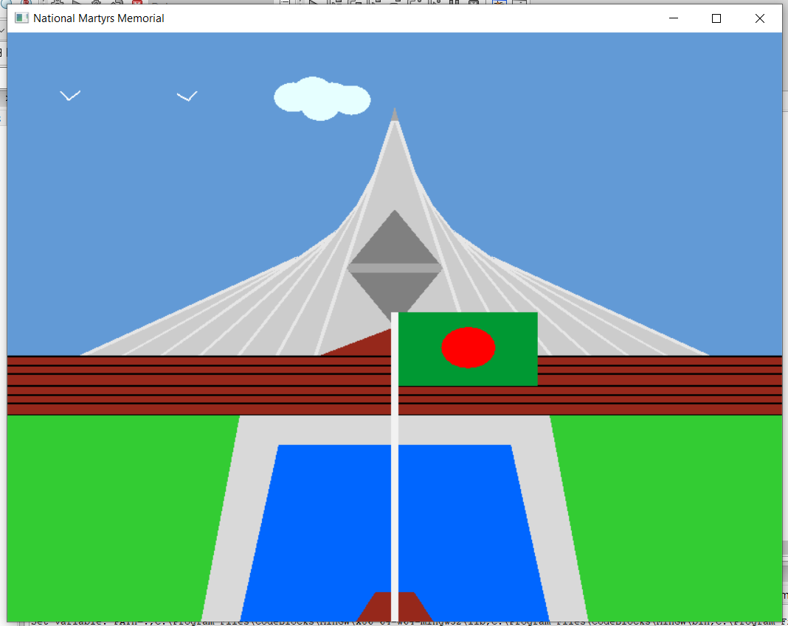

# National Martyrs Memorial

This project is done for my Computer Graphics And Multimedia Course.
This project basically draws our National Martyrs Memorial using 
the OpenGL And Glut.


## Scene Contains:
- A Sky in the back
- Birds
- Cloud
- Stairs to the memorial
- Field
- Pool
- National Flag
- And The Memorial

## Process:
    1. First I have drawn a sky in the back.

    2. Then the stairs to the memorial.

    3. After this the main memorial is Drawn.

    4. And then we have drawn the field, pool and flag to 
       complete the drawing of National Martyrs Memorial.
## Tools Stack:

**Language:** C++

**IDE:** Codeblocks.

**Library:** Glut, Freeglut, OpenGL .


## Output:




## Watch Detailed Project Demonstration On Youtube:

    Link: https://youtu.be/6E06evnAgkQ


## Run Locally:

Clone the project

```bash
  git clone https://github.com/swapnilaanam/National_Martyrs_Memorial.git
```

Go to the project directory

```bash
  open the project file with the .cbp extension in codeblocks
```

Run the project

```bash
  click the compile and run button in the codeblocks
```

Required Library dependencies (If you don't have)

```bash
  download and install freeglut from, 
  https://www.transmissionzero.co.uk/files/software/development/GLUT/freeglut-MinGW.zip
```


## Author:

    Name: Md. Ashraf-Ul-Aanam Swapnil
    ID: 181-115-032


## Project Supervisor:

    Masum Ahmed Eesha,
    Lecturer,
    Metropolitan University, Sylhet.


#
 Made while eating 🌮 In 🕸️-Verse.
